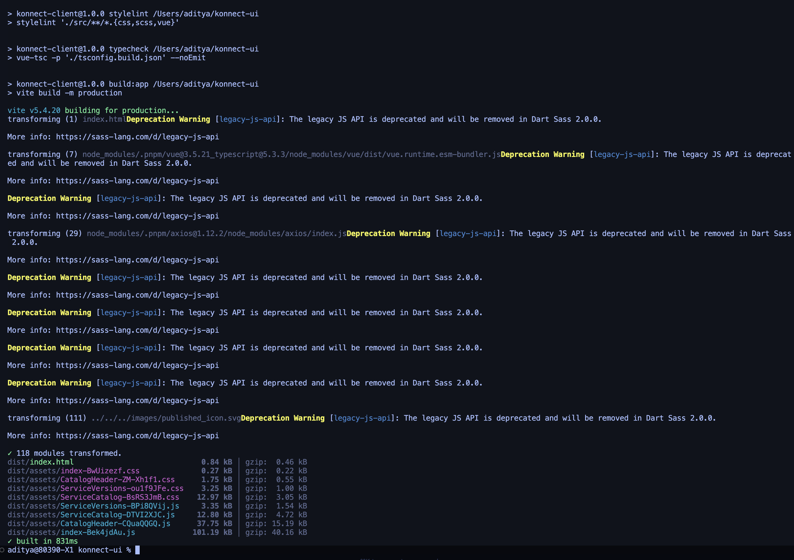

# KONNECT-UI

API service catalog UI

## Demo video

[Click here to view a quick demo of KONNECT-UI](https://www.loom.com/share/f675a9cfa4764284ad0fe9b3930c8036)

## Setup

### Prerequisites

- Node.js 22.19.0 (use `.nvmrc` or Volta)
- pnpm 10.15.1

### Installation

```bash
pnpm install
```

### Running the Application

**Terminal 1 - Start the API server:**

```bash
pnpm dev:server
```

Server runs on `http://localhost:4001`

**Terminal 2 - Start the UI:**

```bash
pnpm dev:ui
```

UI runs on `http://localhost:5173` (opens automatically)

The Vite dev server proxies `/api` requests to the backend server.

### Other Commands

- `pnpm test` - Run tests
- `pnpm build` - Build for production
- `pnpm lint` - Run ESLint
- `pnpm typecheck` - Type check TypeScript

## Design Considerations

### Hybrid Pagination Strategy

- **Desktop (≥768px)**: Traditional pagination with URL params (`page`, `q`) for bookmarking and navigation
- **Mobile (<768px)**: Infinite scroll using IntersectionObserver for better touch UX
- **Rationale**: Optimizes UX per form factor while maintaining URL state for desktop users
- **Sticky Pagination**: Pagination controls are fixed at the bottom of the viewport to avoid layout shift when items on a page are fewer than the page size

### Client-Side Processing

- All filtering and pagination handled in the browser
- Suitable for datasets <100 services
- Future migration to server-side pagination recommended for larger datasets

### Data Transformation

- Frontend transforms API response (`published/configured` booleans → `status` enum, numeric metrics → formatted strings)
- Keeps backend API simple and frontend flexible for UI requirements

### Component Caching with Keep-Alive

- `ServiceCatalog` component is cached using Vue's `keep-alive` to preserve state when navigating away
- When returning to the catalog (component activated), data refreshes silently in the background via `onActivated` hook
- Provides instant navigation back to cached view while ensuring fresh data is loaded
- Reduces perceived loading time and improves navigation UX

### Responsive Breakpoints

- Mobile: <768px (1 column)
- Tablet: 768-1024px (2 columns)
- Desktop: >1024px (3 columns)

### Assumptions

- Search is debounced (300ms) to prevent excessive filtering
- URL query params (`q` for search, `page` for desktop pagination) enable bookmarking
- Mobile ignores `page` param and always starts from top

### Trade-offs

- **Client-side vs Server-side**: Chose client-side pagination for simplicity and instant UX, at the cost of scalability
- **Hybrid pagination**: More complex codebase but better UX per device type
- **Type transformation**: Frontend handles transformation instead of backend, keeping API generic

## Scope of improvement

- Increase test coverage for components and composables
- Explore Vue concepts in depth to understand improvement areas in code

## Notes

- Uses Vue 3 Composition API with TypeScript
- Follows Vue 3 best practices (composables, computed properties, proper typing)
- CSS Grid for responsive card layout
- IntersectionObserver for efficient infinite scroll (no scroll listeners)

## Build on my local



## Credits

Credits to konnect-team for providing awesome open source starter code to build on top of.
